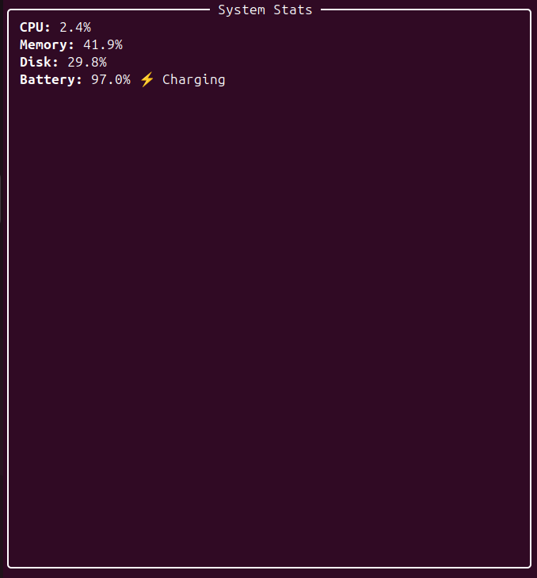
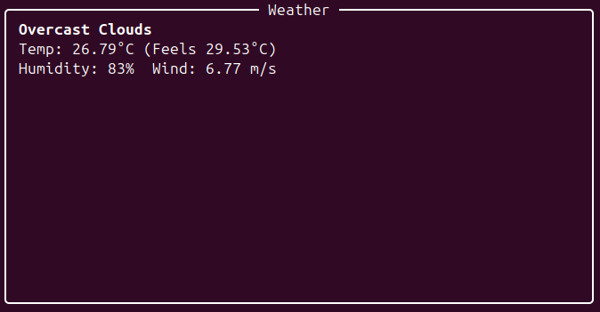
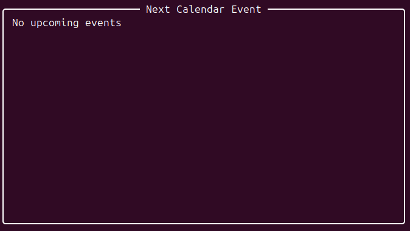

# Personal CLI Dashboard

## Description

A terminal-based dashboard that shows live system stats (CPU, Memory, Disk, Battery), weather updates, and optionally Google Calendar events.
It also logs system stats automatically for monitoring purposes. This project was built as part of the OST component to demonstrate the use of open source technologies.

---

## Tools / Technologies Used

* Python 3
* psutil
* requests
* rich
* python-dotenv
* Google Calendar API
* OpenWeatherMap API
* Ubuntu/Linux
---

## Features

* 📊 Live CPU, Memory, Disk stats
* 🔋 Battery % and charging status
* 🌦️ Weather updates for your city
* 📝 Automatic logging of system stats (`stats_log.csv`)
* 📅 Optional Google Calendar integration

---

## How to Run

```bash
# Clone the repo
git clone https://github.com/kanwaljeetsingh7887/personal-cli-dashboard
cd personal-cli-dashboard

# Create virtual environment and install dependencies
python3 -m venv venv
source venv/bin/activate
pip install -r requirements.txt

# Create .env file and add API keys
cp .env.example .env
nano .env  # Add OPENWEATHER_API_KEY, CITY, GOOGLE_CREDENTIALS etc.

# Run the dashboard
python -m src.dashboard
```
## Screenshots

### System Stats


### Weather Updates


### Google Calendar Event


---

## Contributors

| Student Name         | Role/Contribution                             | GitHub Profile Link                                           |
| -------------------- | --------------------------------------------- | ------------------------------------------------------------- |
| **Kanwaljeet Singh** | Core Python logic, System stats, GitHub setup | [kanwaljeetsingh7887](https://github.com/kanwaljeetsingh7887) |
| **Riddhi Lokhande**  | Weather API integration                       | [RiddhiLokhande](https://github.com/RiddhiLokhande)           |
| **Srihari Nair**     | Google Calendar API integration               | [Srhari1234](https://github.com/Srhari1234)                  |
| Member 4             | Logging & CSV automation                      | [GitHub Link](#)                                              |
| Member 5             | Documentation & Testing                       | [GitHub Link](#)                                              |

---

## Innovation / Novelty
- Combines multiple system metrics, weather updates, and calendar events in a single **terminal-based dashboard**.  
- Logs all system stats automatically for monitoring.  
- Optional Google Calendar integration for productivity tracking.  
- Clean CLI interface with **rich** formatting for better visualization.

---
---

## Timely Submission

- **Submission Timeline:** The project was planned in stages with clear deadlines for each module. We tracked progress using **GitHub issues and milestones**, ensuring each feature was completed on time.  
- **Evidence of Progress:** Regular commits were made to the repository with descriptive messages. Screenshots of the commit history are included below to demonstrate ongoing development and timely contributions.

### Example Commit History Screenshot


## Challenges Faced & Solved
The main challenge was integrating live system stats with Google Calendar events and ensuring smooth real-time updates in the terminal without breaking the logging functionality. We solved it by using **multithreading** and modular Python scripts to separate data fetching, logging, and display, ensuring the dashboard runs efficiently without lag.


---

## Expected vs Actual Output

| Functionality | Expected Output | Actual Output |
|---------------|----------------|---------------|
| CPU, Memory, Disk stats | Live stats updating every second | Displayed correctly in terminal |
| Battery % | Correct percentage & charging status | Displayed correctly |
| Weather updates | Current weather for specified city | Displayed correctly |
| Google Calendar | Next event info | Displayed correctly (if credentials valid) |
| Logging | stats_log.csv updated automatically | Working correctly |


## Future Enhancements

* Add network stats (upload/download speed)
* Add news updates
* Export dashboard to web (Flask/Django)
* Dark/light theme support for CLI

---

## Git Commands Used

```bash
git init
git add .
git commit -m "Initial commit"
git branch -M main
git remote add origin https://github.com/kanwaljeetsingh7887/personal-cli-dashboard.git
git push -u origin main
```

---

